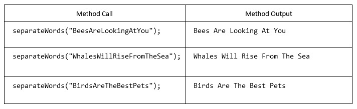

###### CS-207-3: Programming II <br> Spring 2021 <br> Northeastern Illinois University <br> Workshop Week 5 <br> Strings, Part II & StringBuilder & Wrapper Classes

**Getting Started**

**1.** Detailed instructions are located in the tutorial videos.<br>
**2.** Accept the assignment invitation on D2L.<br>
**3.** Clone the assignment to your computer.<br>
**4.** Go to File > Project Structure. Under Project Settings, click on Project and verify that the Project SDK is set
to JDK 11 or higher.  If it is not, select the correct SDK from the drop-down.<br>
**5.** Go to File > Settings (Mac: IntelliJ IDEA > Preferences). Under Build, Execution, Deployment and under Build
Tools, click Gradle. Make sure Build and run using: and Run tests using: are set to Gradle. Make sure Use Gradle from:
is set to 'gradle-wrapper.properties' file. And make sure Gradle JVM is set to JDK 11 or higher.<br>
**6.** Project SDK and Gradle JVM should be set to the same Java version.<br>
**7.** Create the `main/java` directory in the `src` directory. This is where you will be creating your Java classes for
your assignment. Right click `src` and go to New > Directory and select `main/java`.<br>

### Problem 1

**1.** In the main/java directory, create a class named `Words`.
- Write a static method named `separateWords` that takes a `String` as a parameter and returns a `String`.
  The method should break the parameter into individual words based on capital letters.
  The  method should print out each word (including the capital letter) on the same line, separated by spaces.
  You can assume that the parameter always starts with a capital letter.
    - Uncomment the tests in the `WordsTest` class (in the `test/java` directory). 
      Run the tests. Run the code analyzers and commit your code now.



### Problem 2

**1.** In the `main/java` directory, create a class named `StringMath`. It should include the following:
- A static method named `sumNumbers` that takes a `String` as a parameter named `value` and returns an `int`. This method should
  find the sum of all the numbers in `value` and return the sum.
    - **When solving this problem, you may only use methods from the `StringBuilder` class and
      wrapper classes. You may not use String methods or a nested loop.** You may use concatenation.<br>
    - Examples:
      - ```sumNumbers("abc123xyz") → 123```
      - ```sumNumbers("aa11b33") → 44```
      - ```sumNumbers("7 11") → 18```
      - ```sumNumbers("well") → 0```
      - ```sumNumbers("18392") → 18392```
    - Uncomment the tests in the `StringMathTest` class (in the `test/java` directory).
      Run the tests. Run the code analyzers and commit your code now.